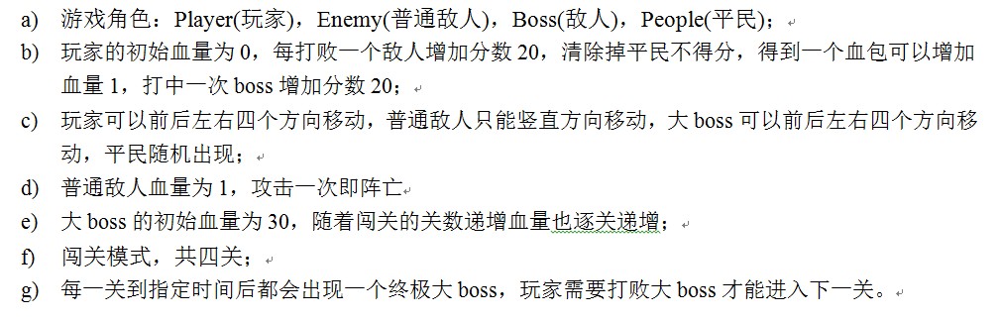
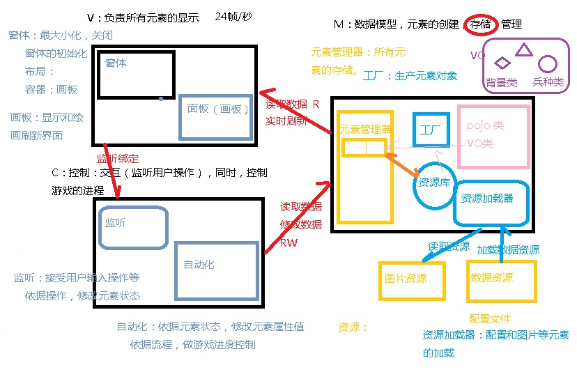
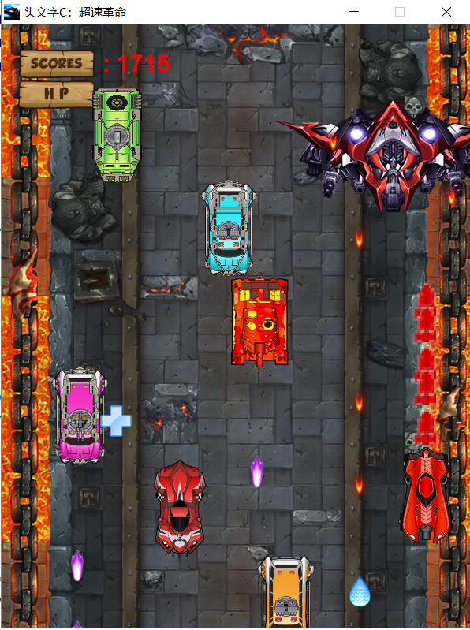
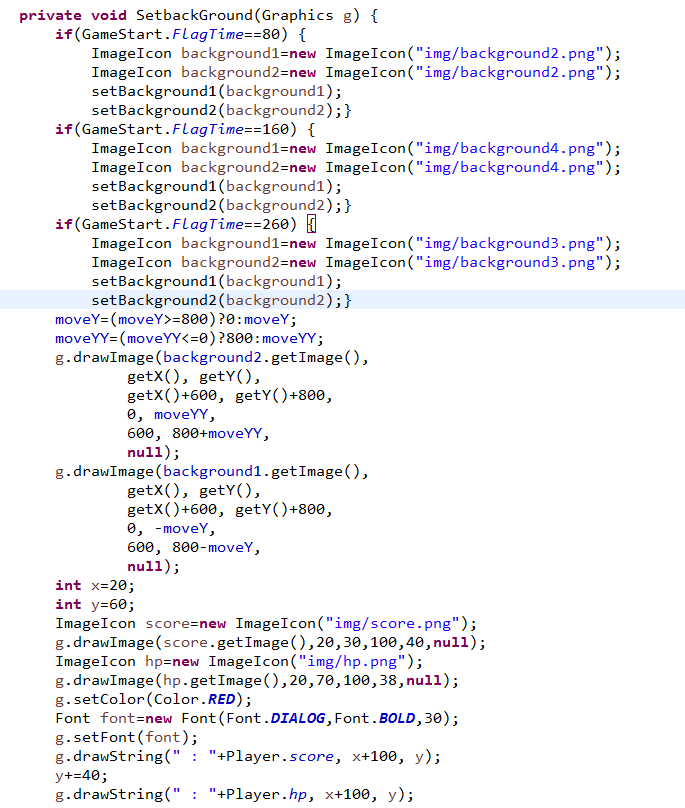
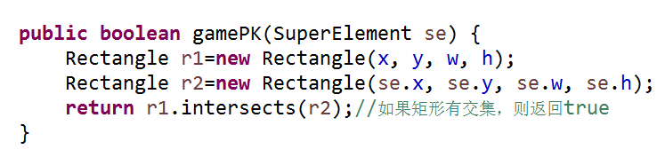

The development platform of this game is:
Operating system: Microsoft Windows
Program language: Java
Development package: **Java JDK 1.8.0** development kit
Development tool: **Eclipse**

**Rules of the game**

**MVC**

In every level, players will encounter a level exclusive boss. At the same time, the game scene will change. Only when they defeat the level exclusive boss can they enter the next level and start a new adventure.Here is the interface of one of the levels.

The entire game has only one entry, which is implemented in the ***gamestart ()*** method.

Load game resources, load players' racing cars, driving pictures on the track, read configuration files, etc. These works are mainly implemented in the ***elementload class*** under the load package.

In package **com.tusky.model.vo** ，the parent classes and all role classes of all roles are defined.
Boss,Enemy,EnemyFire,	Explore,People,Player,PlayerFire,Tools

Here are two key points of this racing game: background scrolling and collision detection.

The reason why a car becomes a car is that the car is moving. In this game, in order to achieve the effect of racing, the effect of rolling from the background is reflected. In order to achieve a better effect of background rotation and rolling, in order to truly move the car in the actual game process, the project innovatively modified the method, defined two img objects with the same background map, staggered moving with the refresh of the thread, truly realize the seamless connection of the background map, and create a good game experience for the players.

We know that when two vehicles run in parallel, the horizontal distance between them is small to a certain extent, they can be considered to have collided. When the longitudinal distance between them is small to a certain extent, they can be considered to have collided. This game checks the X, y coordinates of two cars to determine whether the two rectangles intersect to determine whether the collision occurs. After the collision, different collision effects will be set according to the role identities of the collision parties.
